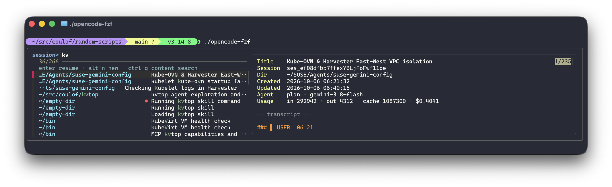

# Random Scripts 🛠️

A collection of utility scripts for Git automation, Homebrew setup, Kubernetes workloads, OpenCode session navigation, and SUSE/Harvester kernel extraction.

## Kubernetes Test Workloads 🧪

Quick single-line commands to deploy lightweight test workloads to Kubernetes clusters:

### Stateless Workload (`whoami`)
Deploy 3 replicas of Traefik `whoami` behind a `LoadBalancer` service:
```bash
# Deploy
kubectl apply -f https://raw.githubusercontent.com/coulof/random-scripts/refs/heads/main/whoami.yaml
```

### Webhook Debugger (`webhook-tester`)
Deploy a lightweight webhook receiver and Web UI (`ghcr.io/tarampampam/webhook-tester`) to inspect incoming HTTP payloads and alerts:
```bash
# Deploy
kubectl apply -f https://raw.githubusercontent.com/coulof/random-scripts/refs/heads/main/webhook-tester.yaml

# Access the Web UI
kubectl port-forward -n cattle-monitoring-system svc/webhook-tester 8080:8080
```

### Stateful Workload (`kbench` FIO)
Run FIO storage benchmarks via Longhorn `kbench`:
```bash
# Deploy / Run benchmark
kubectl apply -f https://raw.githubusercontent.com/longhorn/kbench/main/deploy/fio.yaml
```

### Cluster Rolling Reboot (`harvester-rolling-reboot-plan`)
Perform a safe, sequential rolling reboot of Harvester / RKE2 cluster nodes using the built-in System Upgrade Controller (`system-upgrade-controller`):
```bash
# Apply the Plan
kubectl apply -f harvester-rolling-reboot-plan.yaml

# Trigger an on-demand rolling reboot
kubectl patch plan cluster-rolling-reboot -n cattle-system --type=merge \
  -p "{\"spec\":{\"version\":\"$(date +%Y%m%d%H%M%S)\"}}"

# Watch reboot progress in real-time
kubectl get pods -n cattle-system -l upgrade.cattle.io/plan=cluster-rolling-reboot -w
```

## Scripts

*   **[whoami.yaml](./whoami.yaml)**: Stateless Kubernetes test workload with 3 `traefik/whoami` replicas behind a `LoadBalancer` service.
*   **[webhook-tester.yaml](./webhook-tester.yaml)**: Lightweight webhook testing server and Web UI (`tarampampam/webhook-tester`) in `cattle-monitoring-system` namespace for inspecting incoming HTTP payloads and alerts.
*   **[harvester-rolling-reboot-plan.yaml](./harvester-rolling-reboot-plan.yaml)**: Sequential rolling reboot plan for Harvester / RKE2 cluster nodes using System Upgrade Controller (`system-upgrade-controller`).
*   **[inspect-harvester-release.sh](./inspect-harvester-release.sh)**: Extracts the kernel version from a Harvester release squashfs image without deploying a node.
*   **[git-all](./git-all)**: Runs specified Git operations (`pull`, `gc`, or `status`) on all Git repositories found recursively under a directory.
*   **[git-pull-all](./git-pull-all)**: Sequentially pulls updates across multiple repositories (fast-forward only).
*   **[git-gc-all](./git-gc-all)**: Performs garbage collection across multiple repositories.
*   **[md2pdf](./md2pdf)**: Converts Markdown documents to beautifully styled PDFs with KaTeX math, Mermaid diagrams, and custom themes.
*   **[check_obsidian_links.py](./check_obsidian_links.py)**: Scans an Obsidian vault recursively to detect and list broken internal links.
*   **[audit_mixed_brackets.py](./audit_mixed_brackets.py)**: Audits an Obsidian vault to find mixed-bracket markdown link typos of the form `[[text](url)]`.
*   **[inspect-sbom.py](./inspect-sbom.py)**: Auto-detects, parses, and queries packages, versions, and licenses from SPDX 2.0 and CycloneDX JSON SBOMs.
*   **[collect-case-info](./collect-case-info)**: Gathers environment details (with `kubectl` auto-probing) and ticket descriptions to generate structured, submission-ready support cases for Rancher, Longhorn, and Kubernetes. Includes the OpenCode skill `support-case-collector`.
*   **[merge_to_pdf.py](./merge_to_pdf.py)**: Merges multiple image files (HEIC, JPG, PNG, WEBP, TIFF, etc.) into an optimized multi-page PDF with size-budget enforcement and customizable watermarking. Includes the OpenCode skill `images-to-pdf`.
*   **[opencode-fzf](./opencode-fzf)**: Fast fuzzy finder and full-text search (SQLite FTS5) front-end for OpenCode sessions with live syntax-highlighted previews and instant session resume.

## Usage: `inspect-harvester-release.sh`

Extracts the kernel version, the list of installed RPM packages, or the bundle container images from a Harvester release without needing to deploy an active node. Downloads the squashfs rootfs and extracts the information, or uses a high-performance fast-path directly querying the lightweight image list from GitHub.

```bash
Usage: ./inspect-harvester-release.sh [options] [version[,version...]]

Options:
  -a, --arch <arch>      Architecture: amd64 (default) | arm64
  -k, --keep             Keep the downloaded and extracted squashfs files
  -q, --quiet            Quiet mode: suppress progress messages and logs
  -p, --packages         List all installed RPM packages instead of kernel version
  -i, --images           List bundle container images instead of kernel version
  -f, --filter <pattern> Filter packages or images by a case-insensitive pattern
  --force-squashfs       Force image list extraction from squashfs (skip GitHub fast path)
  -s, --squashfs <file>  Read from a local squashfs file instead of downloading
  -h, --help             Show this help message
```

### Examples

```bash
# Extract kernel version from Harvester v1.7.0 (defaults to amd64)
./inspect-harvester-release.sh v1.7.0

# Extract kernel version from Harvester v1.2.2 for arm64 architecture
./inspect-harvester-release.sh v1.2.2 arm64

# Suppress log and progress output to retrieve only the raw kernel version
./inspect-harvester-release.sh -q v1.8.1

# Query multiple versions and print their kernel versions
./inspect-harvester-release.sh -q v1.8.1,v1.8.0

# Extract from multiple versions and keep the downloaded assets
./inspect-harvester-release.sh -k v1.7.0,v1.8.0

# List all packages installed in Harvester v1.8.1 (using local rpm or Docker)
./inspect-harvester-release.sh -p v1.8.1

# List all container images bundled in Harvester v1.8.1
./inspect-harvester-release.sh -i v1.8.1

# List Longhorn container images and tags used in Harvester v1.8.1
./inspect-harvester-release.sh -i -f longhorn v1.8.1

# Force the extraction of the container image list from squashfs rootfs for v1.8.1
./inspect-harvester-release.sh -i --force-squashfs v1.8.1

# Extract the kernel version from a local squashfs file
./inspect-harvester-release.sh -s /path/to/rootfs.squashfs

# List all RPM packages from a local squashfs file
./inspect-harvester-release.sh -s /path/to/rootfs.squashfs -p

# List bundle container images from a local squashfs file (requires ISO squashfs)
./inspect-harvester-release.sh -s /path/to/iso-rootfs.squashfs -i
```

## Usage: `git-all`

The `git-all` script runs specified Git operations on all Git repositories found recursively under a target directory.

```bash
# Pull operations
git-all pull                   # pull every repo in the directory & sub-directories
git-all pull ~/SUSE            # pull every repo, fast-forward only
git-all pull -s ~/SUSE         # skip repos with uncommitted changes

# Garbage collection operations
git-all gc                     # gc every repo in the current directory and its subdir
git-all gc ~/SUSE              # gc every repo
git-all gc -a ~/SUSE           # aggressive gc

# Status operations
git-all status                 # check status of every repo in the directory & sub-directories
git-all status ~/SUSE          # check status of every repo (concise short status)

# List operations
git-all list                   # list every repo found recursively
git-all list ~/SUSE            # list every repo found under ~/SUSE
```

## Usage: `md2pdf`

The `md2pdf` script converts Markdown documents to beautifully styled PDFs using a headless browser. It features native support for KaTeX math equations, Mermaid diagrams, and modern CSS themes without requiring LaTeX or root privileges.

### Installation

```bash
chmod +x md2pdf && mv md2pdf ~/.local/bin/md2pdf
```

On its first run, `md2pdf` automatically installs its Node.js dependencies (including a headless Chromium browser via Puppeteer, ~150 MB total) into a isolated directory at `~/.md2pdf/`.

### Options

```text
md2pdf — Markdown to PDF (KaTeX math + Mermaid diagrams, no LaTeX)

Usage:
  md2pdf input.md                     → input.pdf (same directory)
  md2pdf input.md output.pdf          → explicit output path
  md2pdf input.md --theme suse        → SUSE brand theme
  md2pdf input.md --css custom.css    → extra CSS on top of theme
  md2pdf input.md --margins 20mm      → all margins (default: 15mm)
  md2pdf input.md --paper A4          → page format (default: A4)
  md2pdf input.md --landscape         → landscape orientation
  md2pdf input.md --no-math           → skip KaTeX (faster, fully offline)
  md2pdf input.md --no-diagrams       → skip Mermaid (faster, fully offline)
  md2pdf --list-themes                → list available themes

Built-in themes: default, suse, minimal, consulting
```

> [!NOTE]
> KaTeX math rendering and Mermaid diagram rendering require network access to fetch assets from the jsDelivr CDN. Use the `--no-math` or `--no-diagrams` flags to work in fully offline environments.

### Examples

```bash
# Convert input.md to input.pdf in the same directory using default style
md2pdf input.md

# Convert with an explicit output location
md2pdf input.md output.pdf

# Convert using the sleek built-in SUSE brand theme
md2pdf input.md --theme suse

# Convert with custom margins and landscape orientation
md2pdf input.md --margins 20mm --landscape
```

## Usage: `check_obsidian_links.py`

Recursively scans an Obsidian vault, parses frontmatter aliases, and checks that every internal link (`[[target]]` or `[[target|display]]`) resolves to an actual note, media file, or alias within the vault. Reports broken links with source file paths and line numbers.

```bash
# Scan a specific Obsidian vault path
./check_obsidian_links.py /path/to/your/vault

# If no path is specified, it defaults to "~/SUSE/Obsidian/Vault" or the current working directory
./check_obsidian_links.py
```

## Usage: `audit_mixed_brackets.py`

Recursively audits Markdown files for mixed-bracket link typos of the form `[[text](url)]` (unintended combinations of internal wiki-link double brackets and external Markdown link parenthesis).

```bash
# Audit a specific Obsidian vault path
./audit_mixed_brackets.py /path/to/your/vault

# If no path is specified, it defaults to "~/SUSE/Obsidian/Vault" or the current working directory
./audit_mixed_brackets.py
```

## Usage: `inspect-sbom.py`

Inspects and queries software package lists, versions, and declared licenses from standard Software Bill of Materials (SBOM) documents. Features automatic format detection for both SPDX 2.0 and CycloneDX JSON formats.

```bash
Usage: ./inspect-sbom.py [options] <sbom-file.json>

Options:
  -p, --packages         List all package names and versions (default)
  -l, --licenses         List packages alongside their licenses
  -f, --filter <pattern> Filter packages, versions, or licenses by a case-insensitive regex
  -s, --summary          Print high-level summary statistics of the SBOM contents
  -h, --help             Show this help message
```

### Examples

```bash
# List all packages in an SPDX SBOM
./inspect-sbom.py SL-Micro-Extras-6.2-x86_64-GM.spdx.json

# List all packages and versions in a CycloneDX SBOM
./inspect-sbom.py SL-Micro-Extras-6.2-x86_64-GM.cdx.json

# Print high-level stats and top 10 most common licenses
./inspect-sbom.py -s SL-Micro-Extras-6.2-x86_64-GM.spdx.json

# Find all packages containing "kernel" or "linux" and list their licenses
./inspect-sbom.py -l -f "kernel|linux" SL-Micro-Extras-6.2-x86_64-GM.cdx.json
```

## Usage: `collect-case-info`

Interactive wizard and automated cluster probing tool to collect environment specifications and structure support tickets for SUSE Rancher, Longhorn, and Kubernetes downstream clusters. Supports clipboard copying, file export, JSON export, and optional PDF compiling via `md2pdf`.

```bash
Usage: collect-case-info [options]

Options:
  -a, --auto, --probe  Probe active kubectl cluster context for environment values
  -k, --kubeconfig <f> Path to kubeconfig file (defaults to $KUBECONFIG or ~/.kube/config)
  --lima <instance>    Execute kubectl queries inside specified Lima VM (e.g. vpn-vm)
  --context <name>     Specific Kubernetes context to use within the kubeconfig
  --insecure           Skip TLS certificate verification (--insecure-skip-tls-verify)
  --timeout <seconds>  Timeout in seconds for cluster queries (default: 25)
  -v, --verbose        Enable verbose debug logging for cluster queries
  -i, --interactive    Launch interactive wizard to enter or refine all details
  -t, --template       Generate an empty skeleton template with placeholders
  -o, --output <file>  Save the generated ticket markdown to the specified file path
  -c, --clipboard      Copy the generated ticket markdown to clipboard (pbcopy/xclip/wl-copy)
  -q, --quiet          Quiet mode: suppress banners and progress messages (clean output)
  -e, --editor         Use $EDITOR for multi-line ticket descriptions during interactive mode
  --json               Output case data as structured JSON instead of Markdown
  --pdf                Compile the generated ticket to PDF using md2pdf
  --theme <theme>      Theme to pass to md2pdf when --pdf is used (default: suse)
  -h, --help           Show this help message
```

### Examples

```bash
# Print a blank support case template to stdout
./collect-case-info -t -q

# Auto-probe active cluster with a specific kubeconfig file
./collect-case-info -a -k /path/to/cluster-kubeconfig.yaml -q

# Auto-probe a cluster routed through a Lima VPN VM (e.g. vpn-vm)
./collect-case-info -a --lima vpn-vm -k /path/to/rke2-kubeconfig.yaml -q

# Auto-probe active kubectl cluster context and copy filled template to clipboard
./collect-case-info -a -c

# Run the interactive questionnaire wizard using $EDITOR for long descriptions
./collect-case-info -i -e -o my-case.md

# Auto-probe active cluster and compile directly to a SUSE-branded PDF
./collect-case-info -a --lima vpn-vm -k cluster.yaml --pdf -o my-case.md

# Export case data to JSON format
./collect-case-info -t -q --json
```

### OpenCode Skill: `support-case-collector`

The OpenCode skill is defined in **[`skills/support-case-collector/SKILL.md`](./skills/support-case-collector/SKILL.md)**. When active in an OpenCode session, you can paste raw logs, error traces, or describe issues conversationally, and the assistant will auto-probe cluster contexts, interview for missing data, and format the case directly.

## Usage: `merge_to_pdf.py`

Merges multiple images in any format (Apple HEIC photos, JPG, PNG, WEBP, TIFF, etc.) into an optimized multi-page PDF document. Features automatic EXIF auto-orientation, iterative compression to enforce a target file size budget (e.g. `< 2.0 MB`), and customizable text or image watermarking (filigrane).

### Options

```text
Usage: ./merge_to_pdf.py [options] <image1> [image2 ...]

Basic Options:
  -o, --output <path>            Output PDF file path (default: merged.pdf)
  --max-size-mb <size>           Maximum target PDF file size in MB (default: 2.0)
  --max-dimension <pixels>       Maximum image width/height in pixels (default: 2400)
  --quality <1-100>              Starting JPEG compression quality (default: 82)

Watermark / Filigrane Options:
  -w, --watermark <text>         Text string to watermark across pages (e.g. "CONFIDENTIEL")
  --watermark-repeat             Tile watermark repeatedly across the page
  --watermark-opacity <0.0-1.0>  Watermark opacity (default: 0.25)
  --watermark-angle <degrees>    Watermark rotation angle (default: -45.0)
  --watermark-color <name|hex>   Watermark color name or hex code (default: gray)
  --watermark-size <points>      Watermark font size in points (default: auto)
  --watermark-image <path>       Path to image stamp/logo to overlay centered
  -h, --help                     Show this help message
```

### Examples

```bash
# Basic merge of mixed image formats into a single PDF
./merge_to_pdf.py photo1.heic scan2.png receipt.jpg -o document.pdf

# Merge and compress images to stay under a 1.5 MB limit
./merge_to_pdf.py *.jpg -o portfolio.pdf --max-size-mb 1.5

# Add a subtle centered watermark across all pages
./merge_to_pdf.py contract1.png contract2.png -o draft.pdf -w "CONFIDENTIEL"

# Add a repeated/tiled watermark for document protection (rental/identity files)
./merge_to_pdf.py id1.heic id2.heic -o dossier.pdf -w "DOSSIER LOCATION 2026" --watermark-repeat --max-size-mb 1.0

# Add a custom colored stamp with custom opacity
./merge_to_pdf.py scan.jpg -o out.pdf -w "ANNULÉ" --watermark-color red --watermark-opacity 0.35

# Overlay an image stamp/logo
./merge_to_pdf.py page1.png page2.png -o certified.pdf --watermark-image stamp.png
```

### OpenCode Skill: `images-to-pdf`

The OpenCode skill is defined in **[`skills/images-to-pdf/SKILL.md`](./skills/images-to-pdf/SKILL.md)**. When active, you can ask the assistant to combine photos/scans into a PDF, apply watermarks/filigranes, and ensure files meet size restrictions for online portals.

## Usage: `opencode-fzf`

An interactive terminal UI front-end for OpenCode sessions powered by `fzf` and an incremental SQLite FTS5 full-text index. Allows instant browsing, full-text content searching across transcripts, and one-key session resumption.



### Key Features

*   **Fuzzy Session Browser**: Filter sessions by date, workspace directory, or session title.
*   **Full-Text Search (`-g`)**: Search message transcripts in real time with BM25 relevance ranking and prefix matching.
*   **Rich Live Preview**: Displays session metadata (session ID, directory, model, token usage, cost) alongside full markdown transcripts (syntax-highlighted with `bat` when installed).
*   **Instant Resumption**: Press `Enter` to resume the selected session (`opencode -s <id>`) or `Alt-n` to launch a new session in the target directory.
*   **Safe & Non-Destructive**: Attaches OpenCode's SQLite database strictly read-only and maintains an external incremental search index (`~/.cache/ocf/index.db`).

### Installation & Alias

Make executable and optionally symlink to your `$PATH` as `ocf`:

```bash
chmod +x opencode-fzf
ln -s "$(pwd)/opencode-fzf" ~/.local/bin/ocf
```

### Commands

```bash
# Browse all sessions (fuzzy search on title, directory, date)
./opencode-fzf [query]

# Full-text search across all message contents
./opencode-fzf -g [query]

# Check database schema compatibility
./opencode-fzf doctor

# Update or rebuild the search index manually
./opencode-fzf index [--rebuild]
```

### Keybindings

| Key | Action |
| :--- | :--- |
| `Enter` | Resume selected session in its working directory |
| `Alt-n` | Launch a new OpenCode session in the selected directory |
| `Ctrl-g` | Toggle between session browsing and full-text search modes |
| `Ctrl-d` / `Ctrl-u` | Scroll preview pane half-page down / up |
| `Ctrl-t` / `Ctrl-b` | Jump preview pane to top / bottom |

### Environment Variables

| Variable | Default | Description |
| :--- | :--- | :--- |
| `OPENCODE_DB` | `~/.local/share/opencode/opencode.db` | Path to OpenCode's SQLite database |
| `OCF_INDEX` | `~/.cache/ocf/index.db` | Path to sidecar SQLite FTS5 search index |
| `OCF_DIR_WIDTH` | `28` | Truncation width for the directory column |

### Requirements

*   `fzf` (>= 0.38)
*   `sqlite3` with FTS5 support (>= 3.35)
*   `bat` (optional, enables syntax-highlighted markdown preview)

## Prerequisites

Dependencies are defined in the **[Brewfile](./Brewfile)** (e.g., `squashfs` for kernel extraction). Install via Homebrew:

```bash
brew bundle
```
